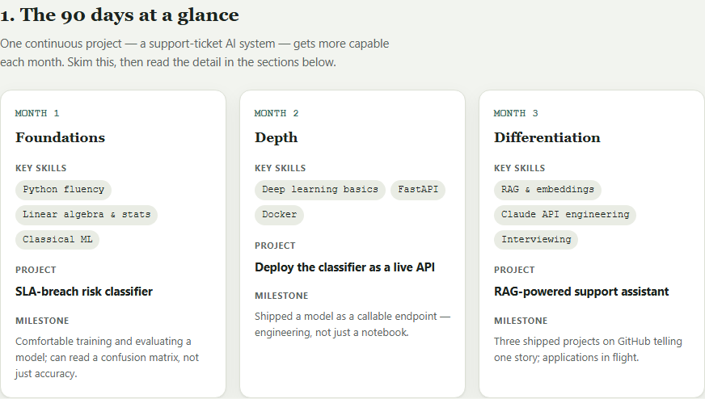
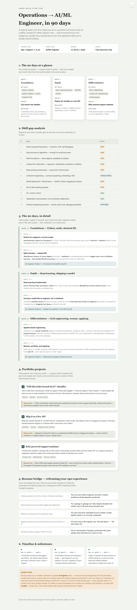
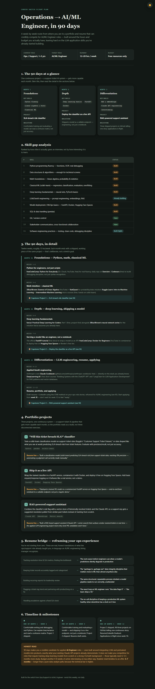

# 🧭 AI/ML Engineer — 90-Day Flight Plan

Built an AI-powered career switch roadmap tool using Claude — generates personalised 90-day plans with skill gap analysis and portfolio project suggestions.

**🔗 Live version:** [https://r-soundariya.github.io/AI-projects/Career%20Roadmap/](https://r-soundariya.github.io/AI-projects/Career%20Roadmap/)

## The problem

Career switching is confusing without a guide. "Learn Python" and "build projects" are true and useless — nobody tells you *which* Python, *which* projects, in *what order*, using *which free resources*, or how your current job's experience actually transfers. Generic roadmaps assume you're starting from zero and have unlimited time and a course budget. Most career-switchers have neither.

## The Claude-generated roadmap

Fed Claude your actual constraints — current role (Operations/Support, 1–3 yrs), target role (AI/ML Engineer), available time (12–20 hrs/week), and budget (free resources only) — and it generated a specific plan rather than generic advice:

- **Skill gap analysis** — 11 skills ranked by how often they actually gate an interview, each marked Have / Building / Build
- **12-week plan** — week-by-week themes with named free resources (freeCodeCamp, Kaggle Learn, 3Blue1Brown, fast.ai, the Claude Cookbook, DeepLearning.AI)
- **3 portfolio projects that build on each other** — a support-ticket classifier → deployed as a live API → wrapped in a Claude-powered RAG assistant, so the portfolio reads as one continuous build instead of three disconnected exercises
- **An honest timeline** — including what 90 days does *not* buy you, and a realistic 5–7 month estimate to an actual offer

## The visual timeline

A 3-column month-by-month view — skills, project, and milestone for each month — so the plan is scannable at a glance before diving into the week-by-week detail:

## Resume bridge

The roadmap also translates the ops/support role into language an AI/ML engineering hiring manager recognizes — real transferable skills, not a stretch:

| From (ops/support) | To (AI/ML engineering) |
|---|---|
| Tracking resolution-time & SLA metrics, finding the bottleneck | The root-cause instinct engineers use when a model's predictions silently degrade in production |
| Keeping ticket records accurately tagged and categorized | The "garbage in, garbage out" data-integrity discipline that matters more in ML than almost anywhere else |
| Building recurring reports for leadership review | The same structured, repeatable-process mindset a model pipeline needs to run correctly, unattended |
| Flagging a ticket-tag trend and partnering with product/eng on a fix | The exact loop an ML engineer runs: "the data flags X" → "the team ships a fix" |
| Handling escalations against a fixed SLA clock | The on-call discipline of keeping a production ML system healthy when downtime has a clock on it too |

## Screenshots

| Roadmap (light) | Roadmap (dark) |
|---|---|
|  |  |

📄 Full walkthrough of the page as a PDF: [index.pdf](index.pdf)

## How to run

No install, no server — download `index.html` and double-click it. Includes a light/dark toggle that remembers your choice.

## Tech

- Single self-contained HTML file — vanilla JS + CSS, zero dependencies
- Theme-aware CSS custom properties for instant light/dark switching, persisted in `localStorage`
- Content generated with Claude from a specific set of constraints (role, experience, hours, budget) rather than templated advice
