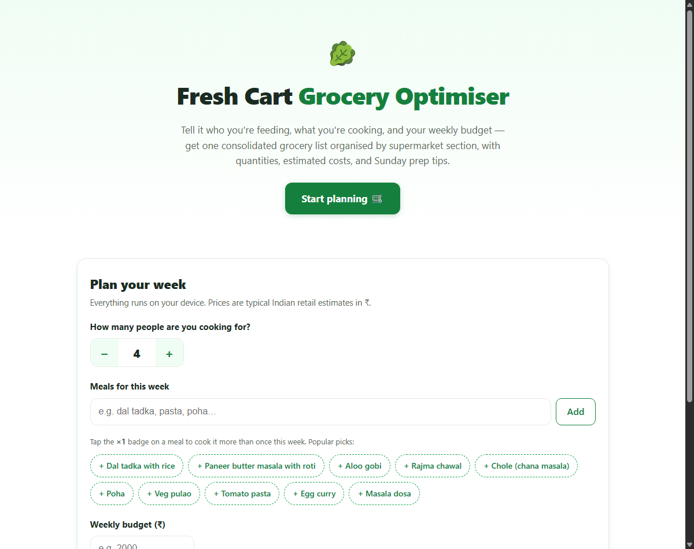
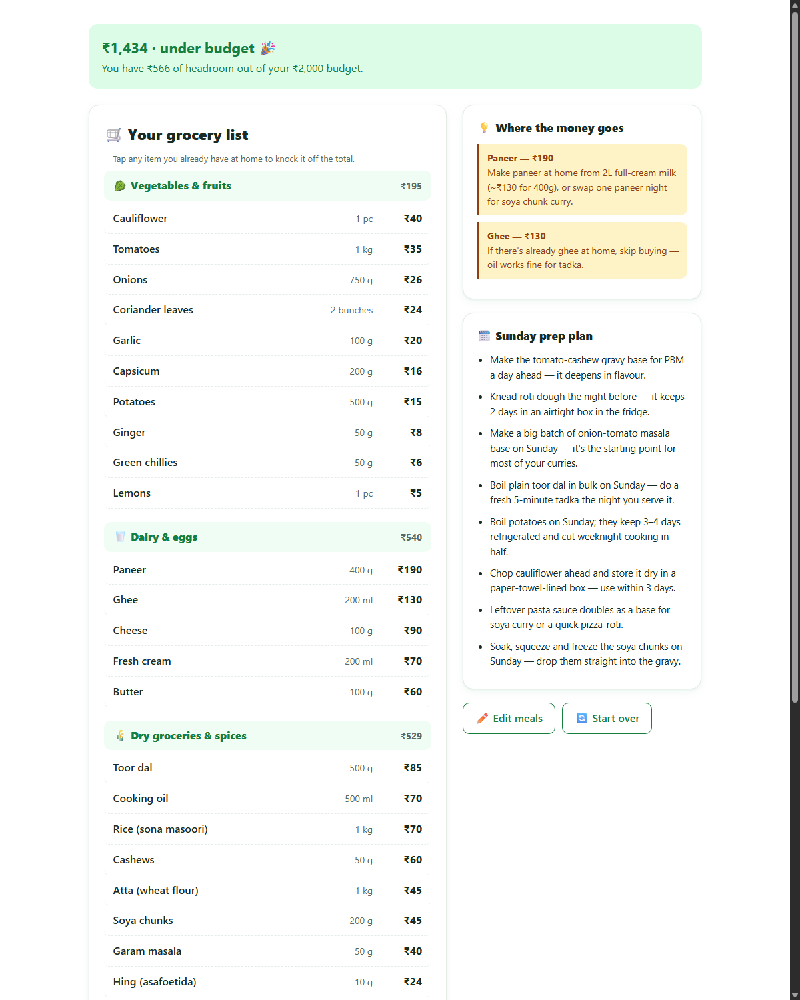

# 🥬 Fresh Cart — AI Grocery List Optimiser

Built an AI grocery list optimiser using Claude — generates deduplicated, section-organised grocery lists from weekly meal plans with cost estimates.

**🔗 Live demo:** [https://r-soundariya.github.io/AI-projects/Grocery%20list%20optimiser/](https://r-soundariya.github.io/AI-projects/Grocery%20list%20optimiser/)

## What it does

Tell it how many people you're feeding, which meals you're cooking this week, and your budget — it produces one consolidated grocery list:

- 🧮 **Deduplicates ingredients** across meals (onions for 5 curries = one line item) and scales quantities to your household size, rounded to realistically buyable pack sizes
- 🗂️ **Organised by supermarket section** — vegetables & fruits, dairy & eggs, dry groceries & spices, packaged items
- ₹ **Cost estimates** per item, per section, and total, checked against your weekly budget
- 💡 **Flags the expensive items** and suggests cheaper swaps (home-made paneer, cashew paste instead of cream…)
- 🗓️ **Sunday prep plan** — deduplicated make-ahead tips for the week's meals
- ✅ Tap items you already have at home to knock them off the total

## Screenshots

| Plan your week | Your optimised list |
|---|---|
|  |  |

📄 Full walkthrough of the site as a PDF: [index.pdf](index.pdf)

## How to run

No install, no server, no build step — download `index.html` and double-click it. Everything runs in the browser and works offline.

## AI fallback for unknown dishes

The app ships with a built-in database of **45 common dishes** (Indian staples + global favourites). Optionally, add an Anthropic API key in the ⚙️ Settings panel and it uses **Claude** (via the Messages API with structured outputs, called directly from the browser) to work out ingredients, quantities, and prices for *any* dish you type. Results are cached locally so repeat lookups are free; the key never leaves your device except to call `api.anthropic.com`.

## Tech

- Single self-contained HTML file — vanilla JS + CSS, zero dependencies
- Fuzzy meal matching (aliases + token overlap) so "paneer masala" finds *Paneer butter masala*
- Claude API (`claude-opus-4-8`) with JSON-schema structured outputs for the AI fallback
