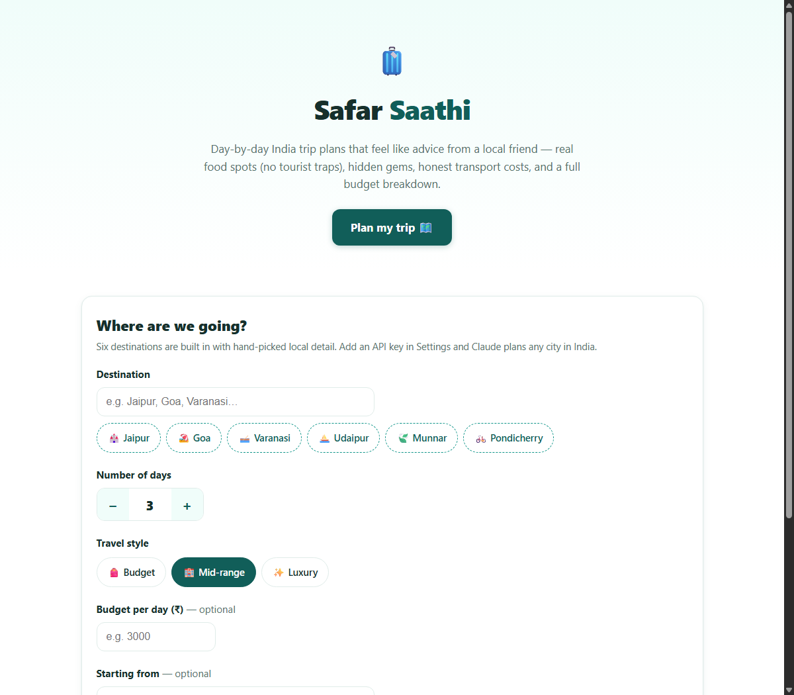
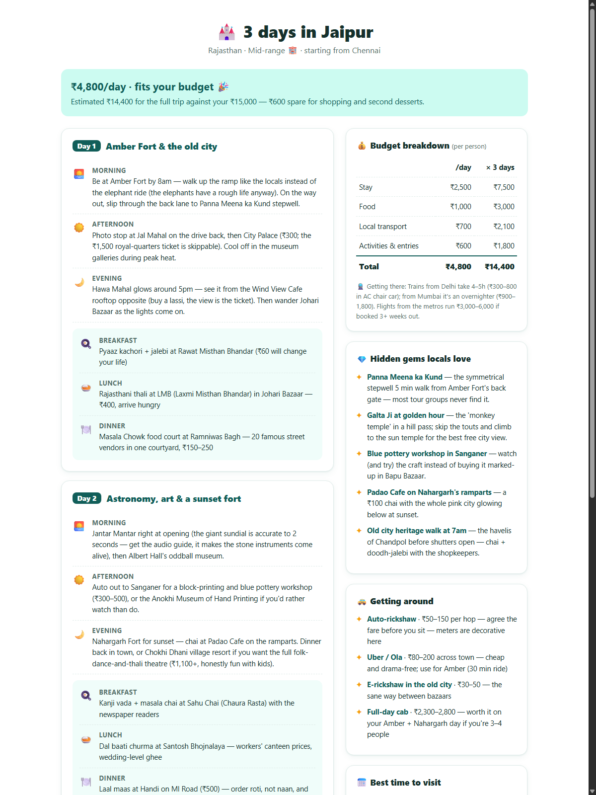

# 🧳 Safar Saathi — India Trip Planner

Built an AI India trip planner using Claude — generates day-by-day itineraries with local food spots, hidden gems, transport costs, and a full budget breakdown, written like advice from a local friend.

**🔗 Live demo:** [https://r-soundariya.github.io/AI-projects/India%20trip%20planner/](https://r-soundariya.github.io/AI-projects/India%20trip%20planner/)

## What it does

Pick a destination, trip length, travel style (budget / mid-range / luxury), and optionally a daily budget — it builds a complete plan:

- 🗓️ **Morning / afternoon / evening itinerary** for every day, with timings and honest tips (which fort to hit at 8am, which ticket to skip)
- 🍛 **Real local food spots for every meal** — the kachori shop locals queue at, not the tourist-trap rooftop
- 💎 **Hidden gems** most itineraries miss — stepwells behind forts, sunrise jeep safaris, hole-in-the-wall feni bars
- 🚕 **Transport between locations with costs** — plus a rough getting-there estimate from your starting city
- 💰 **Budget breakdown** per day and for the full trip, checked against your budget with style-downgrade suggestions
- 📅 **Best time to visit and what to avoid** — seasons, scams, and crowd traps, stated plainly

## Screenshots

| Plan your trip | Your itinerary |
|---|---|
|  |  |

📄 Full walkthrough of the site as a PDF: [index.pdf](index.pdf)

## How to run

No install, no server, no build step — download `index.html` and double-click it. Works offline.

## Built-in destinations + AI for everywhere else

Six destinations ship with deep, hand-curated itineraries: **Jaipur, Goa, Varanasi, Udaipur, Munnar, and Pondicherry**. Add an Anthropic API key in the ⚙️ Settings panel and **Claude** plans *any* Indian destination via the Messages API (called directly from the browser, structured JSON output). Generated plans are cached locally; the key never leaves your device except to call `api.anthropic.com`.

## Tech

- Single self-contained HTML file — vanilla JS + CSS, zero dependencies
- Fuzzy destination matching with aliases ("pondy" → Pondicherry, "banaras" → Varanasi)
- Per-style cost model (budget/mid/luxury tiers per city) with live budget-fit checking
- Claude API (`claude-opus-4-8`) with JSON-schema structured outputs for the AI fallback
