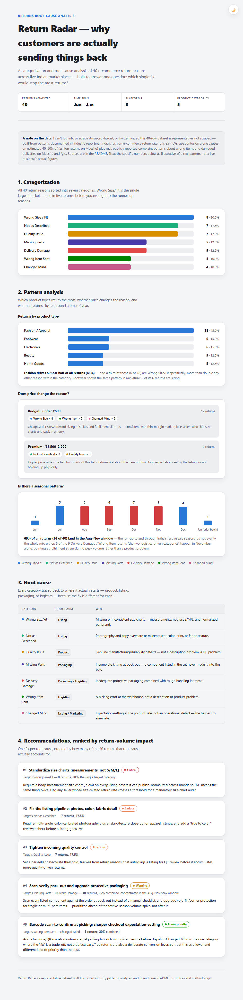
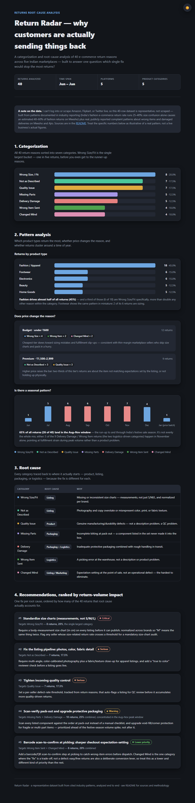

# 📦 Return Radar — E-commerce Returns Root-Cause Analysis

Built a returns root-cause analysis tool using Claude — categorizes return reasons, surfaces price and seasonal patterns, and prioritizes fixes by how many returns each one would actually stop.

**🔗 Live version:** [https://r-soundariya.github.io/AI-projects/Return%20Radar/](https://r-soundariya.github.io/AI-projects/Return%20Radar/)

## The problem

Returns quietly eat margin, and most stores never get past "returns are up" to *why*. "Wrong size," "changed mind," and "damaged in transit" all show up as the same generic "returned" tag in most order systems — so nobody can tell whether the fix is a better size chart, tighter QC, or sturdier packaging. This project takes 40 return reasons and turns them into four things a product team could actually act on: what the returns are, what patterns exist, why they're really happening, and what to fix first.

## The data

I can't log into or scrape Amazon, Flipkart, or Twitter live, so [`data/return_reasons.csv`](data/return_reasons.csv) is a **representative dataset, not a scraped one** — 40 rows across 5 product categories (Fashion, Footwear, Electronics, Beauty, Home Goods) and 5 platforms (Myntra, Flipkart, Amazon, Meesho, Ajio), built from patterns documented in real industry reporting:

- India's e-commerce return rate runs 15–35% overall, with fashion/ethnic wear at 25–40%. — [Ecommerce Return Statistics 2026](https://trackvid.in/blogs/ecommerce-return-statistics.html)
- Size confusion alone causes an estimated 40–60% of fashion returns on Meesho. — [Meesho Seller Tips to Reduce Returns](https://trackecom.in/blog/meesho-seller-tips-returns-profit)
- Color mismatch, size confusion, and missing fabric/texture detail are the top 3 image/listing-related return triggers across Amazon, Flipkart, Myntra, and Ajio. — [Reduce Returns With Better Product Images](https://ckstudio.in/reduce-returns-flipkart-amazon-better-product-images/)
- Other documented drivers: listing/expectation mismatch, COD doorstep cancellations, transit damage, and wrong-item-sent. — [How to Reduce Returns in Ecommerce India](https://trackvid.in/blogs/how-to-reduce-returns-in-ecommerce-india.html)
- Real, publicly reported complaints of wrong items and refund pushback on Meesho, and damaged/poor-quality deliveries on Ajio. — [Consumer Court thread](https://consumercourt.net/threads/scam-by-meesho-by-sending-wrong-product-and-deny-return-and-refund.2467/), [Ajio Trustpilot reviews](https://www.trustpilot.com/review/ajio.com?page=6)

Treat the specific counts in the report as illustrative of a real, cited pattern — not a live business's actual figures.

## The analysis

1. **Categorization** — all 40 returns sorted into 7 categories with counts and percentages. Wrong Size/Fit is the largest single bucket (20%).
2. **Pattern analysis** — Fashion drives 45% of all returns, a third of which are sizing specifically. Cheaper items skew toward sizing/fulfillment mistakes; pricier items skew toward listing-mismatch and quality complaints. 65% of all returns land in the Aug–Nov festive-season window, with delivery-damage and wrong-item returns concentrated in November — a fulfillment-strain signal, not a product one.
3. **Root cause** — every category traced to product, listing, packaging, or logistics, because the fix is different for each.
4. **Recommendations** — one fix per root cause, ranked by how much return volume it actually accounts for: standardized size charts first, then listing/photography fixes and QC, then pack-out verification and packaging, with picking-error scanning and checkout expectation-setting last.

## Screenshots

| Report (light) | Report (dark) |
|---|---|
|  |  |

📄 Full walkthrough of the page as a PDF: [index.pdf](index.pdf)

## How to run

No install, no server — download `index.html` and double-click it. Includes a light/dark toggle that remembers your choice.

## Tech

- Single self-contained HTML file — vanilla JS + CSS, zero dependencies
- Charts and category colors built to a validated, colorblind-safe categorical palette (checked with a contrast/CVD validator), not eyeballed
- Theme-aware CSS custom properties for instant light/dark switching, persisted in `localStorage`
- Data grounded in cited, real return-pattern research rather than fabricated from nothing
